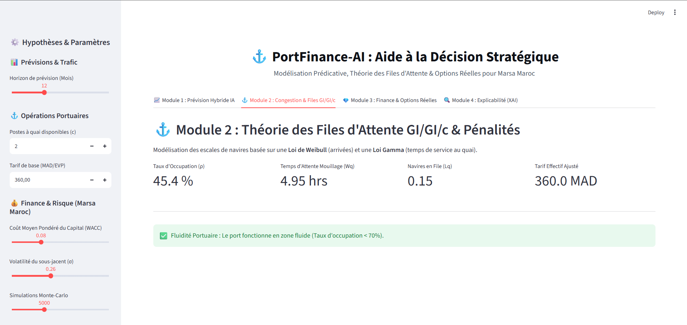
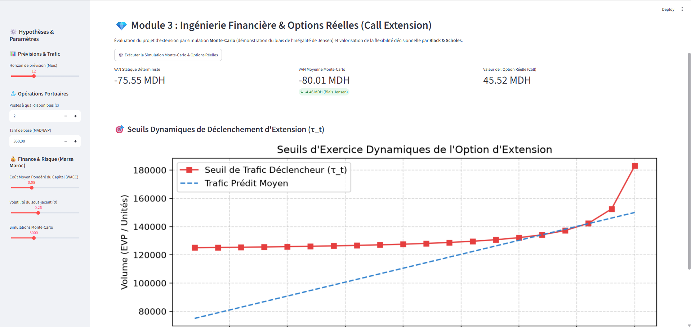
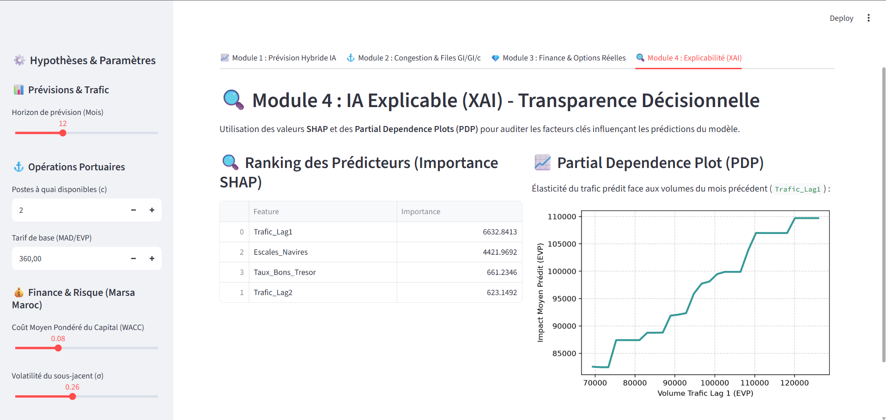

# ⚓ PortFinance-AI

**PortFinance-AI** est une plateforme avancée d'aide à la décision stratégique conçue pour l'optimisation opérationnelle et financière portuaire (inspirée par le contexte de **Marsa Maroc**). Elle combine des modèles d'Intelligence Artificielle pour la prévision de trafic, la théorie des files d'attente pour la modélisation de la congestion, et l'évaluation d'options réelles pour guider les investissements d'infrastructure sous incertitude.

---

## 🚀 Fonctionnalités & Modules

L'application est structurée en 4 modules complémentaires :

### 📈 1. Prévision de Trafic Hybride (STL + LSTM + ARIMA + XGBoost)
* **Décomposition STL** : Sépare la série temporelle en Tendance, Saisonnalité et Résidus.
* **LSTM (PyTorch)** : Capture la tendance à long terme grâce à un réseau de neurones récurrents.
* **ARIMA** : Modélise la composante saisonnière cyclique.
* **XGBoost** : Apprend sur les résidus pour capter les chocs opérationnels à court terme.

### ⚓ 2. Simulation de Congestion & Files d'Attente (GI/GI/c)
* **Modélisation non-markovienne** : Ajustement de lois de probabilité réelles sur les données d'escales navires (Loi de Weibull pour les inter-arrivées et Loi Gamma pour le temps de service).
* **Allen-Cunneen & Marchal** : Calcul analytique des temps d'attente moyens ($W_q$) et de la longueur de file ($L_q$) pour $c$ postes à quai.
* **Pénalité financière** : Évaluation d'une fonction de pénalité tarifaire non linéaire due aux retards de congestion.

### 💎 3. Finance Stochastique & Options Réelles
* **Biais de Jensen** : Démonstration théorique par simulation de Monte-Carlo de l'écart entre la VAN déterministe et la VAN stochastique réelle sous contraintes de capacité.
* **Black-Scholes Call** : Valorisation financière de l'option d'extension de capacité (Phase 2) comme une option d'achat américaine/européenne réelle.
* **Seuils d'exercice dynamiques** : Calcul de la frontière optimale pour déclencher l'investissement au cours de la concession.

### 🔍 4. IA Explicable (XAI)
* **Interprétabilité SHAP** : Utilisation des valeurs SHAP (TreeExplainer) pour identifier et classer les variables les plus influentes sur les prévisions du modèle XGBoost.
* **Partial Dependence Plots (PDP)** : Analyse de l'élasticité et de la sensibilité du trafic prédit face aux variations des volumes historiques.

---

## 📂 Structure du Projet

```text
portfinance_ai/
│
├── app/
│   ├── app.py                     # Interface utilisateur Streamlit principale
│   └── components/                # Composants UI optionnels
│
├── src/
│   ├── __init__.py
│   ├── forecasting.py             # Algorithmes de prévision hybrides STL-LSTM-ARIMA-XGBoost
│   ├── queueing.py                # Calculs de files d'attente GI/GI/c & pénalités de congestion
│   ├── finance.py                 # Simulations Monte-Carlo de VAN & modèle Black-Scholes
│   └── explainability.py          # Analyse SHAP & Partial Dependence Plots (XAI)
│
├── data/
│   └── raw/                       # Fichiers de données générés (CSV)
│
├── generate_synthetic_data.py     # Script de génération de données de simulation
├── requirements.txt               # Dépendances Python requises
└── README.md                      # Documentation du projet
```

---

## ⚙️ Installation & Lancement

### 1. Prérequis
Assurez-vous d'avoir Python 3.12 ou 3.13 installé.

### 2. Cloner le projet et préparer l'environnement
Dans votre terminal (PowerShell ou Bash) :

```bash
# Cloner le dépôt
git clone <url-du-depot-github>
cd portfinance_ai

# Créer un environnement virtuel
python -m venv .venv

# Activer l'environnement
# Sur Windows (PowerShell) :
.venv\Scripts\Activate.ps1
# Sur Windows (CMD) :
.venv\Scripts\activate.bat
# Sur Linux/macOS :
source .venv/bin/activate
```

### 3. Installer les dépendances
```bash
pip install -r requirements.txt
```

### 4. Générer les données de simulation (si nécessaire)
Si le dossier `data/` n'existe pas ou est vide, générez les jeux de données synthétiques de test :
```bash
python generate_synthetic_data.py
```

### 5. Lancer l'application Streamlit
```bash
streamlit run app/app.py
```
L'application s'ouvrira automatiquement à l'adresse [http://localhost:8501](http://localhost:8501).

---

## 🛠️ Stack Technique
* **Dashboard** : Streamlit
* **Modélisation Machine Learning / DL** : PyTorch (LSTM), XGBoost, Statsmodels (ARIMA), Scikit-Learn
* **Explicabilité** : SHAP
* **Calcul & Visualisation** : NumPy, Pandas, SciPy, Matplotlib, Seaborn, Plotly

## 📸 Aperçu de la Plateforme

| Module 1 : Prévision Hybride IA | Module 2 : Congestion GI/GI/c |
|:---:|:---:|
|  |  |

| Module 3 : Options Réelles | Module 4 : IA Explicable (XAI) |
|:---:|:---:|
|  |  |
